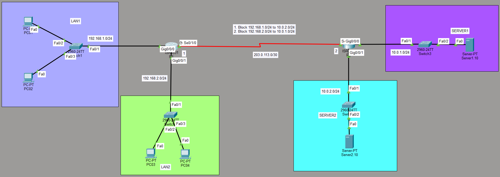

# Standard ACL

Range: Standard ACLs use identification numbers 1–99 and 1300–1999.

Criteria: They only inspect the source address. They cannot filter based on destination, protocol (TCP/UDP), or port numbers.

Placement: Because they lack destination awareness, the general rule is to place them as close to the destination as possible. Placing them near the source might inadvertently block traffic destined for other allowed networks.

Implicit Deny: Every ACL ends with an invisible "deny all" statement. If a packet doesn't match any permit lines, it is dropped.

## Network Topology



## Network Architecture & Addressing

| Segment | Network Address | Default Gateway | Attached Devices / Role |
| :--- | :--- | :--- | :--- |
| **LAN 1** | `192.168.1.0/24` | `192.168.1.1` | PC01, PC02 |
| **LAN 2** | `192.168.2.0/24` | `192.168.2.1` | PC03, PC04 |
| **WAN Link** | `203.0.113.0/30` | — | Serial Link (R1 $\leftrightarrow$ R2) |
| **SERVER 1** | `10.0.1.0/24` | `10.0.1.1` | Critical Server 1 |
| **SERVER 2** | `10.0.2.0/24` | `10.0.2.1` | Critical Server 2 |

## Security Policies & ACL Objectives

To protect sensitive infrastructure, the following traffic rules are enforced at the network layer:

1. **Rule 1:** Block all traffic originating from **LAN 1** (`192.168.1.0/24`) destined for **SERVER 2** (`10.0.2.0/24`).
2. **Rule 2:** Block all traffic originating from **LAN 2** (`192.168.2.0/24`) destined for **SERVER 1** (`10.0.1.0/24`).
3. **Default Behavior:** Permit all other IP traffic to ensure functional communication across unrestricted paths.

## Configuration & Implementation

The filtering policies are implemented on the destination router (**R2**) using Standard Numbered ACLs applied to outbound interfaces.

### 1. Securing SERVER 1 Segment (Gig0/0/0)
```bash
R2# configure terminal
R2(config)#ip access-list standard BLOCK_LAN1_To_SERVER2
R2(config-std-nacl)#deny 192.168.1.0 0.0.0.255
R2(config-std-nacl)#permit any
R2(config-std-nacl)#remark #Block LAN1 access to SERVER2#

R2(config)#interface gigabitEthernet 0/0/1
R2(config-if)#ip access-group BLOCK_LAN1_To_SERVER2 out

```
### 2. Securing SERVER 2 Segment (Gig0/0/1)
```bash
R2# configure terminal
R2(config)#ip access-list standard BLOCK_LAN2_to_SERVER1
R2(config-std-nacl)#deny 192.168.2.0 0.0.0.255 
R2(config-std-nacl)#permit any
R2(config-std-nacl)#remark #Block LAN2 access to SERVER1#

R2(config)#interface gigabitEthernet 0/0/0
R2(config-if)#ip access-group BLOCK_LAN2_to_SERVER1 out


```
## Show Configuration
### ACL
```bash
R2#show access-lists 
Standard IP access list BLOCK_LAN1_To_SERVER2
    10 deny 192.168.1.0 0.0.0.255
    20 permit any
Standard IP access list BLOCK_LAN2_to_SERVER1
    10 deny 192.168.2.0 0.0.0.255
    20 permit any

